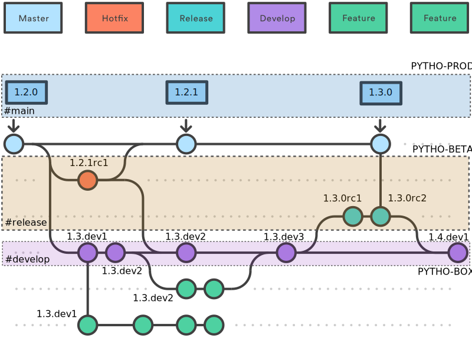

# Prometeia Extended GitFlow

The *PromeBuilder* package helps standardizing the development workflow, integrating the classical [GitFlow](https://nvie.com/posts/a-successful-git-branching-model/) with [(Ana)Conda](https://anaconda.org) distribution system.

Resources:
- [GitFlow cheatsheet](https://danielkummer.github.io/git-flow-cheatsheet/)
- [Semantic Versioning](https://semver.org/)

